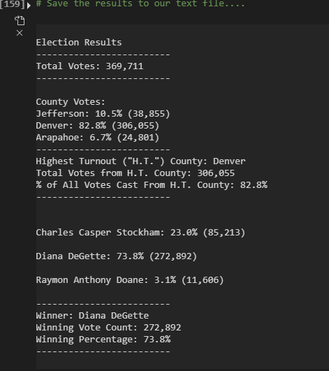

# Election Analysis
Python analysis practice using data relating to differently-formatted ballot counts. 

## Steps Overview
The following tasks were included in the original summary analysis:
    1. Calculate total votes cast
    2. Get list of all candidates who recieved votes
    3. Calculate total number of votes for each candidate
    4. Calculate percentage of total votes for each candiate
    5. Determine winner of election based by highest vote count
    6. Output formatted summary to text file in /Analysis

## Resources
* Data Source: Resources/election_results.csv
* Software: Python 3.9.1, Visual Studio Code 1.52.1

## Summary
The summary analysis found:

Candidates:
* Charles Casper Stockham
* Diana DeGette
* Raymon Anthony Doane

Here is the programmatically generated output text, copied from Analysis/election_analysis.txt:
```
Election Results
-------------------
Total Votes: 369,711
-------------------
Charles Casper Stockham: 23.0% (85,213)
Diana DeGette: 73.8% (272,892)
Raymon Anthony Doane: 3.1% (11,606)
```
## Overview of Election Audit
For the second part of this exercise, an audit was performed to summarize the ballot data by county (as requested by the election commission). The goals of this additional analysis were to identify how many votes were cast from each county present in the data, and to summarize the total number and percent of total votes cast from that county.

## Election-Audit Results
* How many votes were cast in this congressional election?
    - A total of 369,711 votes were cast in this election.
* Provide a breakdown of the number of votes and the percentage of total votes for each county in the precinct.
    - Jefferson: 10.5% (38,855)
    - Denver: 82.8% (306,055)
    - Arapahoe: 6.7% (24,801)
* Which county had the largest number of votes?
    - Denver county had an overwhemling majority of the total vote count: over 300,000 votes. The next closest county was Jefferson, with just under 39,000 votes.
* Provide a breakdown of the number of votes and the percentage of the total votes each candidate * received.
    - Charles Casper Stockham: 23.0% (85,213 votes)
    - Diana DeGette: 73.8% (272,892 votes)
    - Raymon Anthony Doane: 3.1% (11,606 votes)
* Which candidate won the election, what was their vote count, and what was their percentage of the total votes?
    - The winner of this election was Diana DeGette. She won in a landslide, with 73.8% of all votes cast for her (272,892 votes).
The above referenced the terminal output of this analysis, as shown below:



## Election-Audit Summary
This script is fairly flexible and can be used to summarize data from any election. This is because the list of elements used to group vote counts (here, Candidate or County Name) is dynamically generated, instead of being hardcoded as search parameters (see the first piece of [my VBA analysis script](https://github.com/frankfeder/stocks-analysis/blob/main/VBA_Challenge.vbs) for an example of what this *doesn't* need to do).

This is done through creating an empty dictionary and filling it with a key/value pair of "grouping element name"/"total matching records count", as below as we iterate through each row:
```
candidate_votes = {}
# (many lines removed here for concision: check PyPoll_Challenge.py)
if candidate_name not in candidate_options:
        candidate_options.append(candidate_name)
        candidate_votes[candidate_name] = 0
    candidate_votes[candidate_name] += 1
```
The above snippet checks if the program is already tracking votes for a certain candidate, and if not, it creates a new dictionary entry to store the total for that candidate. This allows the script to successfully summarize the total votes for any election, regardless of the number of candidates. This does not require any modification to be used in analyzing the results of a different election, so long as the data in the .csv file is formatted as expected.

This script does still have some hardcoding of values: line 47 to 51 in PyPoll_Challenge.py are referencing specific indices within a row where we know the candidate and county are:
```
# Get the candidate name from each row.
candidate_name = row[2]
# Extract the county name from each row.
county_name = row[1]
``` 
This could be modified to enable using this script to analyze a differently formatted set of ballot data. If format differences were a consistent issue, I would recommend creating variables to hold the value of the index. Then we could access that index on each row using the variable as so:
```
# Define indices for this dataset
candidate_index = 2
county_index = 1
# Use our variables to access the relevant info
candidate_name = row[candidate_index]
county_name = row[county_index]
```

This analysis covered grouping votes by Candidate and County. The way that the output file is structures is relatively hardcoded, as seen below in lines 113-118:
```
winning_county_summary = (
        f"-------------------------\n"
        f"Highest Turnout (\"H.T.\") County: {highest_turnout_county_name}\n"
        f"Total Votes from H.T. County: {highest_turnout_county_votes:,}\n"
        f"% of All Votes Cast From H.T. County: {highest_turnout_county_pct:.1f}%\n"
        f"-------------------------\n\n")
```
If the data had another feature we'd like to group by (voter ZIP code for example) it would be the third time we would be duplicating code and making only minor changes. My final recommendation to make this script more robust would be to abstract the generation of the text blocks per summarized feature. One possible implementation could be an input prompt that asks the user to provide the index and name of the feature they'd like to summarize. A different implementation could define a dictionary of {features:indices} that are then iterated through to allow for the summarization of many features very quickly.